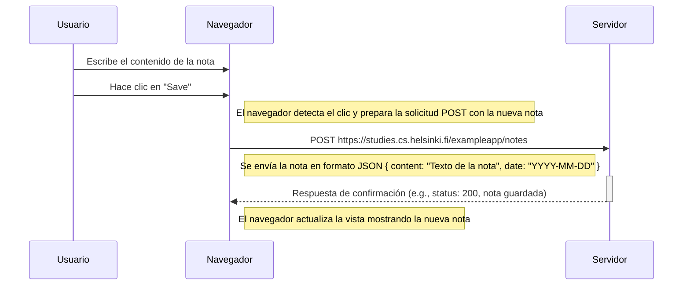

# Notes Form Submission

```mermaid

sequenceDiagram
    participant user as Usuario
    participant browser as Navegador
    participant server as Servidor

    user->>browser: Escribe el contenido de la nota
    user->>browser: Hace clic en "Save"
    Note right of browser: El navegador detecta el clic y prepara la solicitud POST con la nueva nota

    browser->>server: POST https://studies.cs.helsinki.fi/exampleapp/notes
    Note right of browser: Se envía la nota en formato JSON { content: "Texto de la nota", date: "YYYY-MM-DD" }
    activate server
    server-->>browser: Respuesta de confirmación (e.g., status: 200, nota guardada)
    deactivate server

    Note right of browser: El navegador actualiza la vista mostrando la nueva nota
```
