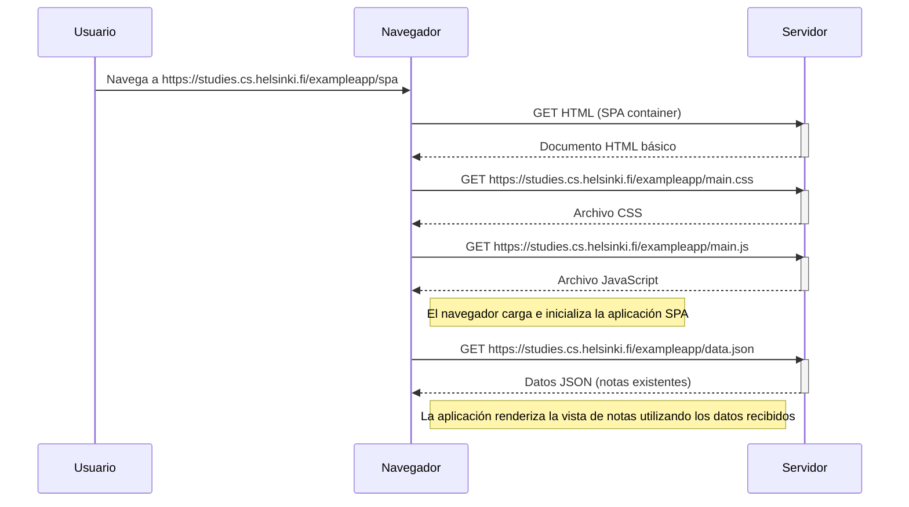

# Single Page App Diagram

```mermaid
sequenceDiagram
    participant user as Usuario
    participant browser as Navegador
    participant server as Servidor

    user->>browser: Navega a https://studies.cs.helsinki.fi/exampleapp/spa
    browser->>server: GET HTML (SPA container)
    activate server
    server-->>browser: Documento HTML básico
    deactivate server

    browser->>server: GET https://studies.cs.helsinki.fi/exampleapp/main.css
    activate server
    server-->>browser: Archivo CSS
    deactivate server

    browser->>server: GET https://studies.cs.helsinki.fi/exampleapp/main.js
    activate server
    server-->>browser: Archivo JavaScript
    deactivate server

    Note right of browser: El navegador carga e inicializa la aplicación SPA

    browser->>server: GET https://studies.cs.helsinki.fi/exampleapp/data.json
    activate server
    server-->>browser: Datos JSON (notas existentes)
    deactivate server

    Note right of browser: La aplicación renderiza la vista de notas utilizando los datos recibidos

```
