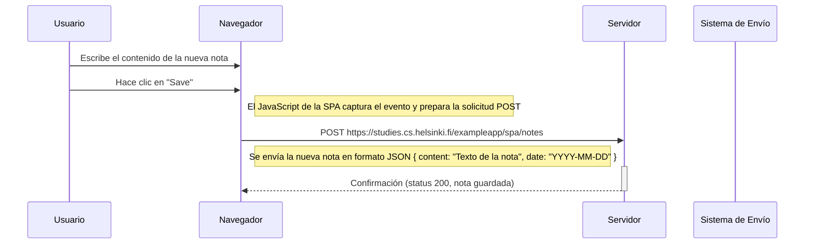

# SPA New Note Creation

```mermaid
sequenceDiagram
    participant user as Usuario
    participant browser as Navegador
    participant server as Servidor
    participant submit as Sistema de Envío

    user->>browser: Escribe el contenido de la nueva nota
    user->>browser: Hace clic en "Save"
    Note right of browser: El JavaScript de la SPA captura el evento y prepara la solicitud POST

    browser->>server: POST https://studies.cs.helsinki.fi/exampleapp/spa/notes 
    Note right of browser: Se envía la nueva nota en formato JSON { content: "Texto de la nota", date: "YYYY-MM-DD" }
    activate server
    server-->>browser: Confirmación (status 200, nota guardada)
    deactivate server

```
